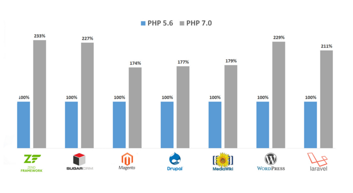

PHP7 has been out for a while now. If you've not upgraded yet, now would be a good time. To get you up to speed, in this post I'll be covering what's new in PHP7. Before we dive, let's find out a little bit more about PHP and its humble beginnings.

## The History of PHP

The story of PHP begins back in 1995 with Rasmus Lerdorf. Rasmus wanted a way of tracking visits to his online resume. He decided to write a set of tool using the C programming language. These tools become known as Personal Home Page Tools (later renamed to simply, PHP).

PHP has grown and changed a vastly since these early versions and is now a multi-paradigm programming language. One of PHP's selling points is the fact that it is so widely supported by hosting providers. This has led to PHP powering around 70% of the internet.

Now that we've had our history lesson, let's see whats new in PHP7.

## New Features

### Scalar Type Declarations

We can now use scalar type declarations. Type declarations allow us to tell a function or method what kinda of arguments to accept. If it receives an unexpected type, it will throw an error. With the addition of scalar types, we can now add the following types:

- String
- Integer
- Float
- Boolean

```php
<?php
function greeting( string $name ) {
  return "Hello, {$name}";
}
```

### Return Types

With PHP7 we can now define return types. This allows PHP to behave much more like a strongly typed language. This is great if you want to catch errors early. It is optional, however, so you don't have to use it if you don't want to.

```php
<?php

declare( strict_types=1 );

function sum( $a, $b ) : int {
  return $a + $b;
}

sum( 1, 5.5 );
```

Notice the `declare( strict_types=1 );`? This is set on a file by file basis. It tells PHP how to treat the return types. By default, this is set to false. In the above example, if `strict_types` was set to `0` the `sum` function would return `7`. This because PHP coerces the result to match the return type. If the above example was executed as is, a catchable fatal error would be thrown.

It is important to note that the `strict_types` directive effects in the file that they are called, not where they are defined.

### Null Coalescing Operator

The Null Coalescing Operator is one of my favourite new features. This piece of syntactic sugar will help keep your code succinct and easy to read. Let's imagine a scenario where we want to handle a form submission and the name filed is optional. Our code might look something like this...

```php
<?php

$username = isset( $_GET['user'] ) ? $_GET['user'] : 'nobody';
```

This checks if the `user` key exists on the `$_GET` array. If it exists, the value is assigned to `$username` otherwise the string `nobody` is assigned.

In PHP7 we can use the null coalescing operator to make this a little easier to read.

```php
<?php

$username = $_GET['user'] ?? 'nobody';
```

We can even chain them together. The first value that exists is used.

```php
<?php

$username = $_GET['user'] ?? $_GET['name'] ?? 'nobody';
```

### Spaceship Operator

This feature definitely has the coolest name. It compares two values and returns `0` if the values are equal, `1` if the first value is greater than the second and `-1` if the second is greater than the first.

```php
<?php

// Integers
echo 1 <=> 1; // 0
echo 1 <=> 2; // -1
echo 2 <=> 1; // 1

// Strings
echo a <=> a; // 0
echo a <=> b; // -1
echo b <=> a; // 1
```

### Constant Arrays

Array constants can now be defined using the define keyword. This is nothing groundbreaking but it is a nice addition.

```php
<?php

define('NEW_FEATURES', [
  'Scalar Type Declarations',
  'Null Coalescing Operator',
  'Spaceship Operator'
]);
```

Note that it has always been possible to define array constants using the `const` keyword.

### Anonymous Classes

PHP7 now has anonymous classes. In my opinions, this is a very cool feature. It seems like a rather strange feature but will be very powerful for writing tests where we need to mock a particular class.

Here is an example lifted directly from the PHP website.

```php
<?php

interface Logger {
  public function log(string $msg);
}

class Application {
  private $logger;

  public function getLogger(): Logger {
    return $this->logger;
  }

  public function setLogger(Logger $logger) {
    $this->logger = $logger;
  }
}

$app = new Application;
$app->setLogger(new class implements Logger {
  public function log(string $msg) {
    echo $msg;
  }
});

var_dump($app->getLogger());
```

### Group Use Declarations

This is a small change but will help keep your use statements tidy and legible.

Again, this is an exampled from the PHP website.

```php
<?php

// Pre PHP 7 code
use some\namespace\ClassA;
use some\namespace\ClassB;
use some\namespace\ClassC as C;

use function some\namespace\fn_a;
use function some\namespace\fn_b;
use function some\namespace\fn_c;

use const some\namespace\ConstA;
use const some\namespace\ConstB;
use const some\namespace\ConstC;

// PHP 7+ code
use some\namespace\{ClassA, ClassB, ClassC as C};
use function some\namespace\{fn_a, fn_b, fn_c};
use const some\namespace\{ConstA, ConstB, ConstC};
```

### Other Features

There a few other minor features which I have not covered in detail in this article. For a full list of them visit [http://php.net/manual/en/migration70.new-features.php](http://php.net/manual/en/migration70.new-features.php)

## Performance

I've saved the best for last. If none of the cool new features above are enough to persuade you to upgrade to PHP7, then hopefully this will.

The engine which PHP runs on (Zend Engine) has gone through a major overhaul. This has led to PHP7 being up to twice as fast as any previous version.



As you can see from the results above, you'd be crazy not to upgrade. Simply by upgrading your version of PHP, your application could run over twice as quickly as it currently does. That's without writing a single line of code. Obviously, there are limitations to this. If your performance bottleneck is your database, PHP7 isn't going to help.

PHP7 has been out for a while now. It is stable and is running in production on many large applications. Now is the perfect time to upgrade.
