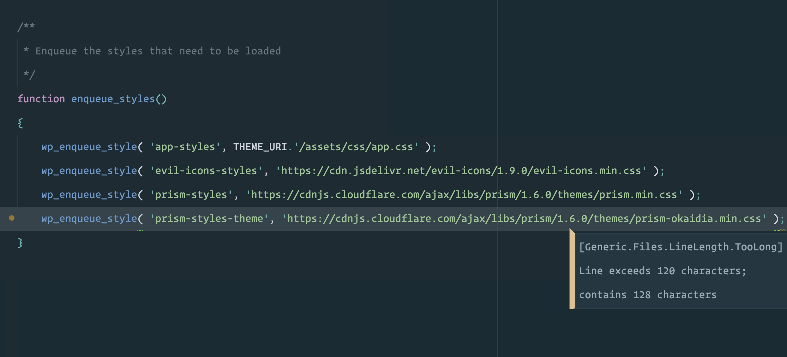
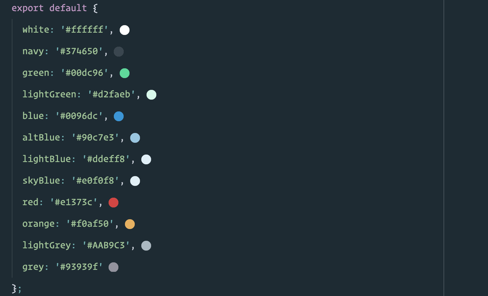
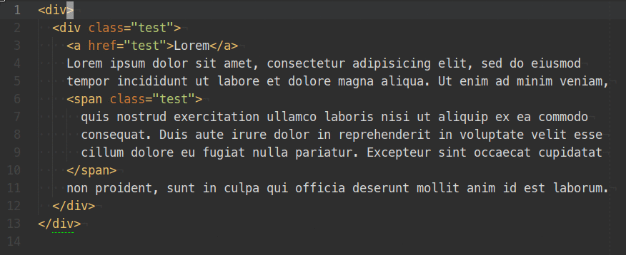

Atom is an open source text editor built by the good folks at [Github](https://github.com). It is built using web technologies including HTML and is completely free to use.

Atom is my main editor and I use it on a daily basis. Below I have listed what I think are some of the best plugins available.

### Emmet
Emmet (formally Zen Coding) is a super useful plugin used to greatly improve the HTML & CSS workflow. Emmet can be used to write CSS-like expressions that can be dynamically parsed to produce chunks of HTML.

### Linter
No good code editor is complete without a linter. A linter watches your code as you type and will highlight any errors or issues. Several other linter plugins are available to support for other languages.

### Pigments
Pigment is a cool plugin that allows visual representation of any colours you use in your code. It can be customised to display the colours in different ways. I personally prefer a small coloured dot after the colour value.

### Minimap
The minimap package adds a "zoomed out" overview of the file you are working on the right side of the editor. This minimap can be clicked or dragged to quickly scroll to any section of the file.

### File Icons
File icons don't add any functionality to Atom, instead, it makes a visual change. This plugin adds file icons to your tree view on the left side of the editor. This can be useful for quickly recognising the file types in the tree view.

### Double Tag
Double Tag is one of my favourite plugins. It will automatically update the matching closing tag as you code. So if you decide you want to change your `div` to a `span`, as you begin changing the opening tag, the closing tag will be updated too.

