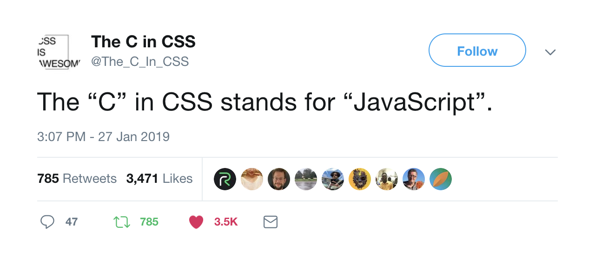

If you've been on the internet recently, you've probably heard of CSS-in-JS.

The technology has been growing in popularity recently but not everyone is a fan. Today, I'd like to demystify what it is and why I think you should be using it.

CSS-in-JS can mean a few things, but primarily it is used to describe the technique of authoring styling logic in JavaScript. This can be done in the form of [inline styles attached to a react component](https://reactjs.org/docs/dom-elements.html#style) or by leveraging a tool like [Styled Components](https://www.styled-components.com/).

Now, if you're anything like me, when you first heard the term CSS-in-JS you probably thought:

> Oh no... not another thing I have to learn!

I have good news though if you already know CSS, you don't really have to learn anything new. But wait, if you already know CSS, then why bother writing CSS-in-JS, doesn't that just add complexity?

## Why I Write CSS-in-JS 🎨

CSS stands for Cascading Style Sheets. Back when CSS was created, we were building websites which were typically pretty simple by today's standards. At the time, the _cascading_ part of CSS was super useful. Today, however, I think it ends up being a foot-gun more often that it is helpful. Think about it, can you remember every class name you used on your last project?

Now imagine working on a project with several other people. Writing CSS that conflicts with or overwrites someone else's styles is essentially inevitable. Techniques like BEM and SMCSS can help but you have to rely on all developers following the rules and as a project grows so do the chances that someone will slip up.

For me, CSS-in-JS and Styled Components in particular help save me from myself. I'm protected from my own mistakes by an API instead of by convention. CSS-in-JS allows me to focus on styling my UI without having to be mindful of overwriting CSS somewhere else.

The cascade can still be useful, however. With Styled Components, you can still take advantage of the cascade but it is limited to the scope of the component you're working on. You **can** have your cake and eat it.

### Performance 🚀

Okay, let's say you never make mistakes. Are there any benefits to CSS-in-JS besides controlling the cascade. As it turns out, there are. CSS-in-JS libraries are responsible for how styles are injected into the DOM. They can track which components are rendered and only inject the styles required.

This means the user ends up downloading fewer bytes of code and will have a quicker time to first paint. Great success.

### Maintenance 🔧

Have you ever wanted to remove some CSS from a project but you had no way to be sure it wasn't being used somewhere. With CSS-in-JS, this usually isn't a problem as styles are typically co-located with the component that relies on them. You'll never have to go hunting for the CSS that is affecting the component your working on again.

### Dynamic Styles

Another benefit of using CSS-in-JS is that you can take advantage of the power of JavaScript. You can use functions to create mixins and reusable style modules, props can be used to create variations of components and variables can be used for theming.

Most CSS-in-JS tools give you all the benefits of traditional CSS preprocessors too, including nested rules and auto-vendor prefixing.

## What are the disadvantages of CSS-in-JS

All tech choices involve some sort of compromise and using CSS-in-JS is no different. The primary drawback of using something like Styled Components is the added complexity. First of all, it needs to be installed from npm. Not a big deal, but it is one extra step.

If you are sever rendering your code, you're going to need to install and configure a babel plugin to make sure your styles work on the first load too.

The other drawback of CSS-in-JS is that it just might not work for your particular application. If you're not using a front end framework like React or Vue, CSS-in-JS is probably not the right choice.

If you're in a situation where CSS-in-JS isn't a great fit, I highly recommend you check out [Tailwind CSS](https://tailwindcss.com/docs/what-is-tailwind/). It is a utility first CSS framework that helps you build UI's rapidly. You don't get any of the benefits of CSS-in-JS but it may help you avoid some of the pitfalls of CSS.

## Closing thoughts

As developers, our job is to solve problems using code. CSS-in-JS is a tool that helps us solve problems more efficiently and write code that should be easier to maintain.

If you've tried a CSS-in-JS solution and it didn't work out, that's cool too. Do what works best for you and your team.

Let me know if you have used CSS-in-JS and what problems it solved/caused for you!
